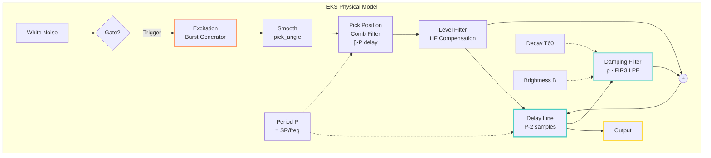
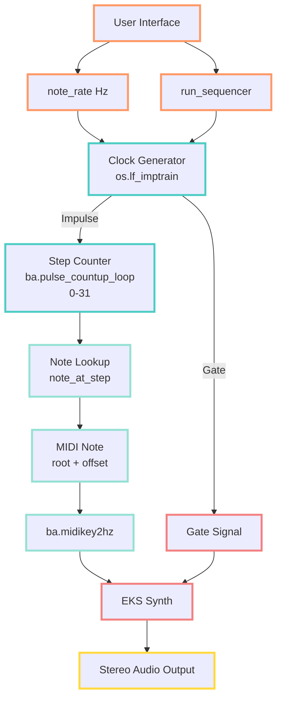
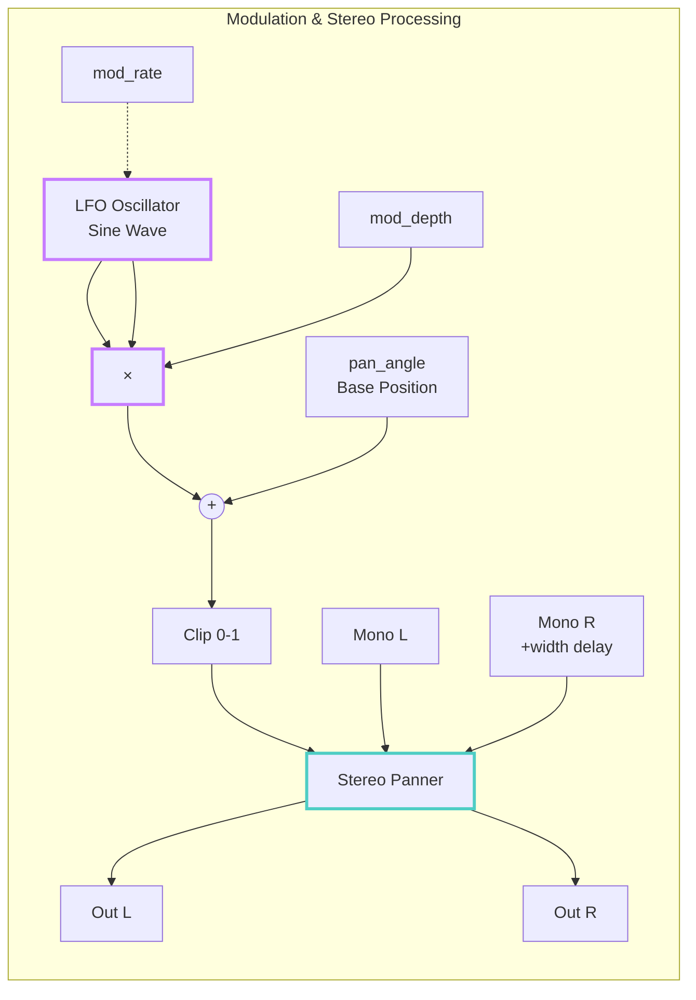

# Extended Karplus-Strong Guitar Synthesizer

[](https://faust.grame.fr/)
[](LICENSE)

---

## Abstract

This project implements **Julius O. Smith III's Extended Karplus-Strong (EKS)** physical modeling algorithm for plucked string synthesis, realized in the Faust programming language. The system features a 32-step sequencer with progressive rock-style arpeggiated patterns, stereo width modulation, LFO-based auto-panning, and high-quality Zita reverb. The implementation extends the original Karplus-Strong algorithm with frequency-dependent damping, pick position modeling, and dynamic-level compensation for realistic string behavior.

**Key Features:**
- Full EKS algorithm with linear-phase FIR damping filters
- 16-step sequencer with Hz-based tempo control
- LFO modulation for spatial movement
- Zita reverb integration
- Real-time parameter control for live performance

**Based on**: Smith, J. O. (2010). "Physical Audio Signal Processing". CCRMA, Stanford University.

---

## 1. Introduction

### 1.1 Physical Modeling Synthesis

Physical modeling recreates instrument behavior through mathematical simulation of acoustic physics. The Extended Karplus-Strong algorithm models plucked string instruments by simulating:
- **Wave propagation**: Delay line representing string length
- **Energy dissipation**: Frequency-dependent damping filters
- **Excitation**: Initial displacement from plucking action
- **Boundary conditions**: Fixed endpoints (bridge and nut)

### 1.2 Extended Karplus-Strong Algorithm

The EKS extends the basic Karplus-Strong (1983) with:
1. **Linear-phase damping**: FIR3 filter for frequency-dependent decay
2. **Pick position modeling**: Comb filter for pluck location effects
3. **Dynamic-level compensation**: Adjustable high-frequency content
4. **Brightness control**: Independent tuning invariance parameter

---

## 2. Mathematical Foundations

### 2.1 One-Zero String Damping Filter

The simplest damping filter uses a single zero:

$$
H_d(z) = \rho[(1-S) + S \cdot z^{-1}]
$$

**Difference equation**:

$$
y[n] = \rho[b_0 \cdot x[n] + b_1 \cdot x[n-1]]
$$

where:
- $S \in [0,1]$ is the stretching factor
- $b_0 = 1 - S$ (feedforward coefficient)
- $b_1 = S$ (delayed feedforward coefficient)
- $\rho \in (0,1)$ is loop gain controlling decay rate

**Brightness mapping**:

$$
S = \frac{B}{2}, \quad b_1 = 0.5 \cdot B, \quad b_0 = 1.0 - b_1
$$

**Decay time calculation**:

$$
\rho = 0.001^{\frac{P \cdot T}{t_{60}}}
$$

where $P$ is period (samples), $T$ is sample interval, $t_{60}$ is -60 dB decay time.

**Characteristics**:
- DC gain = $\rho$ (infinite decay at DC when $\rho=1$)
- Fastest decay at $S = 0.5$ (original Karplus-Strong)
- Higher frequencies decay faster than lower frequencies

---

### 2.2 Two-Zero String Damping Filter (Linear Phase)

For improved tuning invariance, a symmetric FIR filter is used:

$$
H_d(z) = \rho[g_1 + g_0 \cdot z^{-1} + g_1 \cdot z^{-2}]
$$

$$
= \rho \cdot z^{-1}[g_0 + g_1(z + z^{-1})]
$$

**Impulse response**:

$$
h_d = [g_1, g_0, g_1, 0, 0, \ldots]
$$

Symmetric around time $n=1$ (linear phase property).

**Coefficients from brightness**:

$$
h_0 = \frac{1 + B}{2} \quad \text{(center tap)}
$$

$$
h_1 = \frac{1 - B}{4} \quad \text{(side taps)}
$$

**Implementation**:

$$
y_{\text{damp}}[n] = \rho \cdot [h_0 \cdot x[n-1] + h_1 \cdot (x[n] + x[n-2])]
$$

**Loop gain**:

$$
\rho = 0.001^{\frac{1}{f \cdot t_{60}}}
$$

**Advantages**:
- Linear phase (no phase distortion)
- Better tuning invariance than one-zero
- Symmetric impulse response reduces computational complexity

---

### 2.3 Pick-Position Comb Filter

Models the effect of plucking at position $\beta$ along the string:

$$
H_\beta(z) = 1 - z^{-\lfloor \beta N + \frac{1}{2} \rfloor}
$$

where:
- $\beta \in (0, 0.5)$ is normalized pick position ($0$ = bridge, $0.5$ = center)
- $N = P$ is period in samples
- Delay = $\lfloor \beta N + 0.5 \rfloor$ (rounded to nearest integer)
- Feedforward gain = $-1$ (inverts and subtracts delayed signal)

**Spectral effect**: Creates nulls at frequencies $f_k = \frac{k}{\beta \cdot T}$ for integer $k$.

**Physical interpretation**: Plucking at position $\beta$ cannot excite harmonics with nodes at that location.

---

### 2.4 Dynamic-Level Lowpass Filter

Compensates for high-frequency loss based on playing dynamics.

**Continuous-time (analog)**:

$$
H_{L,\omega_1}(s) = \frac{\omega_1}{s + \omega_1}
$$

where $\omega_1 = 2\pi f_1$ (fundamental angular frequency).

**Discrete-time (bilinear transform)**:

$$
H_{L,\omega_1}(z) = \frac{\tilde{\omega}_1}{1+\tilde{\omega}_1} \cdot \frac{1+z^{-1}}{1-\frac{1-\tilde{\omega}_1}{1+\tilde{\omega}_1} \cdot z^{-1}}
$$

where $\tilde{\omega}_1 = \frac{\omega_1 T}{2}$ (prewarped frequency).

**Simplified IIR form**:

$$
H_L(z) = g \cdot \frac{1+z^{-1}}{1-a_1 \cdot z^{-1}}
$$

**Dynamic blending**:

$$
y_{\text{out}}[n] = L \cdot L_0(L) \cdot x[n] + (1-L) \cdot y_{\text{LP}}[n]
$$

where:
- $L \in [0,1]$ is level parameter (from `dynamic_level` slider)
- $L_0(L) = L^{1/3}$ attenuates low levels
- $y_{\text{LP}}[n]$ is lowpass-filtered signal

**Characteristics**:
- Unity DC gain
- -3 dB at fundamental frequency $f_1$
- -6 dB/octave rolloff above $f_1$
- Bypassed at $L=1$ (maximum dynamics)

---

### 2.5 Fundamental Period and Frequency Relationship

**Basic relationship**:

$$
P = \frac{f_s}{f}
$$

where $f_s$ is sample rate and $f$ is fundamental frequency.

**With fractional delay** (for fine tuning):

$$
\text{Total Delay} = P - 2 + \eta
$$

where $\eta \in [0,1)$ is fractional delay for precise tuning.

---

### 2.6 Excitation Signal (Noise Burst)

**Trigger function**:

$$
g_{\text{trigger}}(n) = g \cdot \mathbb{1}_{\{\text{release}(P) > 0\}}
$$

where $\mathbb{1}$ is the indicator function.

**Release envelope**:

$$
\text{release}(n) = \sum_{k} \text{decay}(n, x_k)
$$

$$
\text{decay}(n,x) = x - \frac{\mathbb{1}_{\{x>0\}}}{n}
$$

Creates exponential decay with time constant proportional to period $P$.

**Physical interpretation**: Simulates initial displacement of string at pluck time, with energy proportional to plucking force.

---

## 3. System Architecture

### 3.1 EKS Physical Model Diagram



### 3.2 Sequencer Implementation



### 3.3 Modulation and Stereo Processing



---

## 4. Parameters

### 4.1 Sequencer

| Parameter | Range | Default | Description |
|-----------|-------|---------|-------------|
| `run_sequencer` | {0,1} | 0 | Start/stop sequencer |
| `note_rate` | 1-30 Hz | 12 Hz | Clock speed (12 Hz = 16th notes at 180 BPM) |
| `root_note` | MIDI 36-72 | 64 (E3) | Base pitch |

### 4.2 EKS Synthesis

| Parameter | Range | Default | Description |
|-----------|-------|---------|-------------|
| `gain` | 0-10 | 1.0 | Output level |
| `pick_angle` | 0-0.9 | 0.9 | Pick sharpness (higher = brighter attack) |
| `pick_position` | 0.02-0.5 | 0.13 | Pluck position ($\beta$) |
| `decaytime_T60` | 0-10 s | 1.0 s | String decay time |
| `brightness` | 0-1 | 0.7 | High-frequency content ($B$) |
| `dynamic_level` | -60 to 0 dB | -10 dB | Nyquist-limit level ($L$) |

### 4.3 Spatial

| Parameter | Range | Default | Description |
|-----------|-------|---------|-------------|
| `spatial_width` | 0-1 | 0.5 | Stereo width |
| `pan_angle` | 0-1 | 0.5 | Base stereo position (0=L, 0.5=C, 1=R) |
| `mod_rate` | 0.01-10 Hz | 0.5 Hz | LFO speed for auto-panning |
| `mod_depth` | 0-1 | 0.5 | LFO modulation depth |

### 4.4 Reverb

| Parameter | Range | Default | Description |
|-----------|-------|---------|-------------|
| `reverb_mix` | 0-1 | 0.3 | Dry/wet balance |

---

## 5. Installation and Usage

### 5.1 Faust Web IDE (Quick Start)

1. Navigate to [https://faustide.grame.fr/](https://faustide.grame.fr/)
2. Copy contents of `eks_guitar_sequencer_final.dsp`
3. Click "Run" to compile
4. Enable `run_sequencer` checkbox
5. Adjust `note_rate` slider for tempo control

### 5.2 Local Compilation

```bash
# Compile to C++
faust eks_with_mod.dsp -o eks_with_mod.cpp

# Compile to various targets
faust2jaqt eks_with_mod.dsp        # JACK Qt application
faust2alsa eks_with_mod.dsp        # ALSA standalone
faust2vst eks_with_mod.dsp         # VST plugin
faust2daisy eks_with_mod.dsp       # Electrosmith Daisy
faust2bela eks_with_mod.dsp        # Bela platform
```

---

## 6. Project Structure

```
EKS/
├── eks_guitar_sequencer_final.dsp   # Main implementation (recommended)
├── eks_with_mod.dsp                 # Version with modulation + reverb
├── eks_guitar.dsp                   # Original EKS (fixed syntax)
├── eks_sequencer_test.dsp           # Sequencer test version
├── bass_sequencer.dsp               # Bass sequencer example
├── experiments/                     # Development versions
└── README.md
```

---

## 7. Sequencer Pattern (E Minor Pentatonic)

The 32-step pattern creates cascading arpeggios through E minor pentatonic scale:

**Steps 0-15** (main pattern): E, G, B, E+octave, with ascending/descending motion

**Steps 16-31** (variation): Introduces A and F# passing tones

**Musical context**: Inspired by progressive rock keyboard arpeggios (e.g., Rick Wakeman's style in Yes - "Roundabout").

**Tempo mapping**:
- 6-8 Hz: Slower, deliberate
- 12 Hz: 16th notes at 180 BPM (sweet spot)
- 20-24 Hz: Rapid, virtuosic runs

---

## 8. References

### Foundational Papers

- Karplus, K., & Strong, A. (1983). "Digital Synthesis of Plucked-String and Drum Timbres". *Computer Music Journal*, 7(2), 43-55.
- Smith, J. O. (2010). "Physical Audio Signal Processing for Virtual Musical Instruments and Audio Effects". CCRMA, Stanford University. [https://ccrma.stanford.edu/~jos/pasp/](https://ccrma.stanford.edu/~jos/pasp/)

### Digital Waveguide Theory

- Smith, J. O. (1992). "Physical Modeling Using Digital Waveguides". *Computer Music Journal*, 16(4), 74-91.
- Välimäki, V., et al. (2006). "Discrete-Time Modeling of Musical Instruments". *Reports on Progress in Physics*, 69(1), 1-78.

### Faust Language

- Orlarey, Y., Fober, D., & Letz, S. (2009). "FAUST: an Efficient Functional Approach to DSP Programming". *New Computational Paradigms for Computer Music*, Editions Delatour, France.
- [Faust Programming Language](https://faust.grame.fr/)

---

## 9. License

This project uses the **STK-4.3 license** (Synthesis Toolkit), following the original EKS implementation by Julius O. Smith III. The code is free to use for research and educational purposes.

---

## 10. Author

**George Redpath** (Ziforge)
- GitHub: [@Ziforge](https://github.com/Ziforge)
- Based on: Julius O. Smith III's EKS algorithm

---

## 11. Acknowledgments

- **Julius O. Smith III** - Original Extended Karplus-Strong algorithm and implementation
- **CCRMA, Stanford University** - Physical audio signal processing research
- **Faust Community** - DSP programming language and compiler
- **STK Project** - Synthesis Toolkit framework

---

## 12. Citation

```bibtex
@misc{redpath2025eks,
  author = {Redpath, George},
  title = {Extended Karplus-Strong Guitar Synthesizer},
  year = {2025},
  publisher = {GitHub},
  url = {https://github.com/Ziforge/EKS},
  note = {Based on Smith, J.O. (2010) Physical Audio Signal Processing}
}
```
