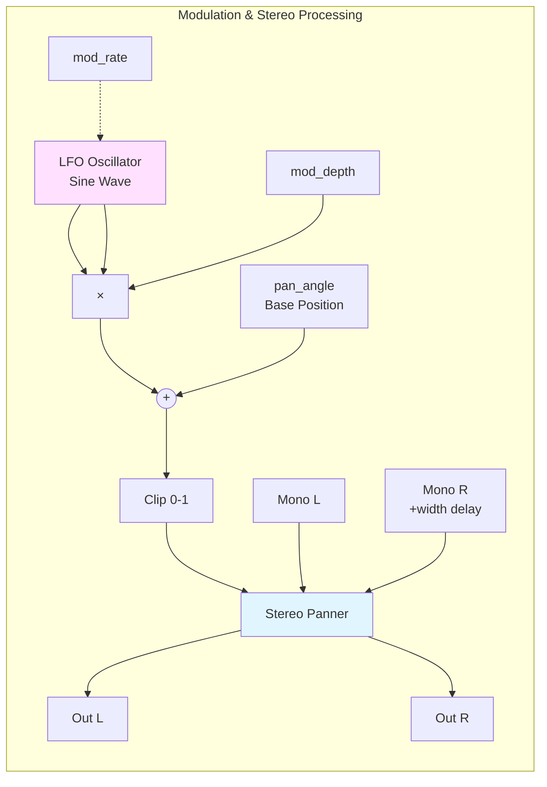
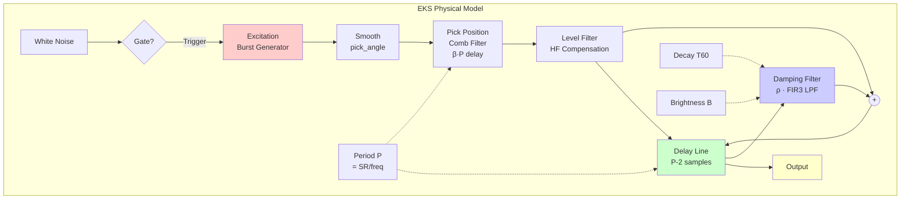
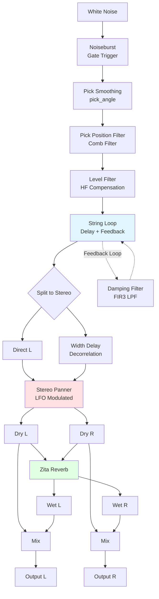

# EKS - Extended Karplus-Strong Guitar Synthesizer

A progressive rock-style arpeggiator built with **Julius Smith's Extended Karplus-Strong (EKS)** physical modeling algorithm, implemented in the Faust programming language.

## Features

- **Physical Modeling Synthesis**: Full EKS algorithm with string loop, damping filters, and pick position modeling
- **16-Step Sequencer**: Fast arpeggiated patterns with adjustable tempo (Hz-based control)
- **Stereo Width & Modulation**: Auto-panning with LFO modulation for spatial movement
- **Zita Reverb**: High-quality stereo reverb with adjustable mix
- **Real-time Control**: All parameters exposed as sliders for live performance

## Quick Start

### Faust Web IDE

1. Go to [https://faustide.grame.fr/](https://faustide.grame.fr/)
2. Copy the contents of `eks_with_mod.dsp`
3. Click "Run" to compile and start playing
4. Check the "run_sequencer" box to start the sequence
5. Adjust `note_rate` slider to control tempo (12 Hz = 16th notes at 180 BPM)

### Local Compilation

```bash
# Compile to C++
faust eks_with_mod.dsp -o eks_with_mod.cpp

# Compile to various targets
faust2jaqt eks_with_mod.dsp        # JACK Qt application
faust2alsa eks_with_mod.dsp        # ALSA standalone
faust2vst eks_with_mod.dsp         # VST plugin
```

## Files

- **`eks_with_mod.dsp`** - Main implementation with modulation and reverb (recommended)
- **`eks_guitar.dsp`** - Original EKS from Julius Smith (fixed syntax)
- **`eks_sequencer_test.dsp`** - Working sequencer test version
- **`bass_sequencer.dsp`** - Simple bass sequencer example

## Parameters

### Sequencer
- **run_sequencer** (checkbox): Start/stop the sequencer
- **note_rate** (1-30 Hz): Clock speed (12 Hz = 16th notes at 180 BPM)
- **root_note** (MIDI 36-72): Base pitch (default E3 = 64)

### EKS Synthesis
- **gain** (0-10): Output level
- **pick_angle** (0-0.9): Pick sharpness (higher = brighter attack)
- **pick_position** (0.02-0.5): Where string is plucked (0.13 = default)
- **decaytime_T60** (0-10s): String decay time (1s for fast arpeggios)
- **brightness** (0-1): High-frequency content (0.7 = bright)
- **dynamic_level** (-60 to 0 dB): Nyquist-limit level

### Spatial
- **center-panned spatial width** (0-1): Stereo width
- **pan angle** (0-1): Base stereo position (0=left, 0.5=center, 1=right)
- **mod_rate** (0.01-10 Hz): LFO speed for auto-panning (0.5 Hz default)
- **mod_depth** (0-1): How much LFO affects panning (0.5 default)



### Reverb
- **reverb_mix** (0-1): Dry/wet balance (0.3 default)

## Technical Details

### Extended Karplus-Strong Algorithm

The EKS algorithm extends the basic Karplus-Strong plucked string model with:

1. **Excitation**: White noise burst shaped by pick angle
2. **Pick Position Filter**: Comb filter modeling where string is plucked
3. **String Loop**: Delay line set to fundamental period
4. **Damping Filter**: Linear-phase FIR3 filter for frequency-dependent decay
5. **Level Filter**: Compensates for high-frequency loss



### Sequencer Implementation

Uses `os.lf_imptrain()` to generate clock pulses at a specified Hz rate, driving a 32-step pattern through E minor pentatonic-inspired arpeggios.

```mermaid
sequenceDiagram
    participant UI as User Interface
    participant CLK as Clock Generator
    participant SEQ as Step Counter
    participant NOTE as Note Lookup
    participant EKS as EKS Synth
    participant OUT as Audio Output

    UI->>CLK: note_rate (Hz)
    UI->>CLK: run_sequencer (on/off)

    loop Every Clock Pulse
        CLK->>SEQ: Generate Impulse
        SEQ->>SEQ: Increment (0-31)
        SEQ->>NOTE: Current Step
        NOTE->>NOTE: Lookup Pitch Offset
        NOTE->>EKS: MIDI Note Number
        CLK->>EKS: Gate Trigger
        EKS->>EKS: Generate String Sound
        EKS->>OUT: Stereo Audio
    end
```

#### Arpeggio Pattern (32 Steps)

```mermaid
graph LR
    subgraph "Steps 0-15: Main Pattern"
        S0[0: E] --> S1[1: G]
        S1 --> S2[2: B]
        S2 --> S3[3: E+8]
        S3 --> S4[4: G+8]
        S4 --> S5[5: E+8]
        S5 --> S6[6: B]
        S6 --> S7[7: G]
        S7 --> S8[8: E]
        S8 --> S9[9: B]
        S9 --> S10[10: E+8]
        S10 --> S11[11: G+8]
        S11 --> S12[12: B+8]
        S12 --> S13[13: G+8]
        S13 --> S14[14: E+8]
        S14 --> S15[15: B]
    end

    subgraph "Steps 16-31: Variation"
        S16[16: A] --> S17[17: B]
        S17 --> S18[18: E+8]
        S18 --> S19[19: F#]
        S19 --> S20[20: E+8]
        S20 --> S21[21: B]
        S21 --> S22[22: A]
        S22 --> S23[23: G]
        S23 --> S24[24: E]
        S24 --> S25[25: B]
        S25 --> S26[26: E+8]
        S26 --> S27[27: G+8]
        S27 --> S28[28: E+8]
        S28 --> S29[29: B]
        S29 --> S30[30: A]
        S30 --> S31[31: G]
    end

    S15 --> S16
    S31 -.Loop.-> S0

    style S0 fill:#90EE90
    style S16 fill:#FFB6C1
```



### Signal Flow



## Musical Notes

The default pattern cycles through:
- **E minor pentatonic**: E, G, B, with octave jumps and passing tones
- **32 steps**: Creates flowing, cascading arpeggios
- **Inspired by**: Progressive rock piano arpeggios (think Yes - "Roundabout" style)

Adjust `note_rate` for different feels:
- **6-8 Hz**: Slower, more deliberate
- **12 Hz**: 16th notes at 180 BPM (sweet spot)
- **20-24 Hz**: Rapid, virtuosic runs

## Credits

- **Original EKS Algorithm**: Julius O. Smith III (CCRMA, Stanford)
- **Reference**: [Virtual Electric Guitars](http://ccrma.stanford.edu/~jos/pasp/vegf.html)
- **Faust Implementation**: Modified from Julius Smith's examples
- **License**: STK-4.3

## References

- [Faust Programming Language](https://faust.grame.fr/)
- [Julius Smith's Physical Audio Signal Processing](https://ccrma.stanford.edu/~jos/pasp/)
- [Karplus-Strong Algorithm](https://en.wikipedia.org/wiki/Karplus%E2%80%93Strong_string_synthesis)

## Demo

Perfect for 30-second progressive rock demo clips showcasing physical modeling synthesis!

---

**Repository**: Private
**Created**: 2025
**Status**: Active Development
