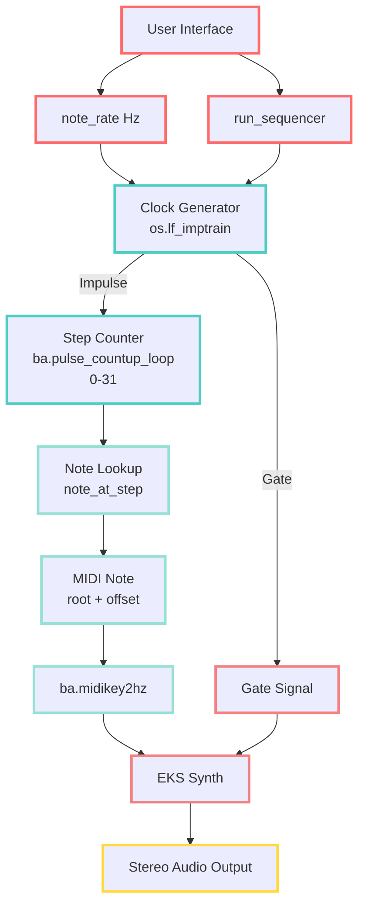
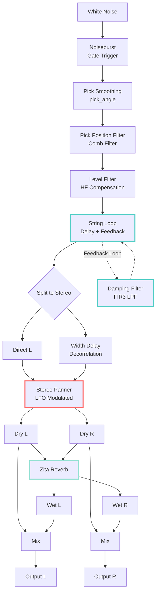

# EKS - Extended Karplus-Strong Guitar Synthesizer

A progressive rock-style arpeggiator built with **Julius Smith's Extended Karplus-Strong (EKS)** physical modeling algorithm, implemented in the Faust programming language.

## Features

- **Physical Modeling Synthesis**: Full EKS algorithm with string loop, damping filters, and pick position modeling
- **16-Step Sequencer**: Fast arpeggiated patterns with adjustable tempo (Hz-based control)
- **Stereo Width & Modulation**: Auto-panning with LFO modulation for spatial movement
- **Zita Reverb**: High-quality stereo reverb with adjustable mix
- **Real-time Control**: All parameters exposed as sliders for live performance

## Quick Start

### Faust Web IDE

1. Go to [https://faustide.grame.fr/](https://faustide.grame.fr/)
2. Copy the contents of `eks_with_mod.dsp`
3. Click "Run" to compile and start playing
4. Check the "run_sequencer" box to start the sequence
5. Adjust `note_rate` slider to control tempo (12 Hz = 16th notes at 180 BPM)

### Local Compilation

```bash
# Compile to C++
faust eks_with_mod.dsp -o eks_with_mod.cpp

# Compile to various targets
faust2jaqt eks_with_mod.dsp        # JACK Qt application
faust2alsa eks_with_mod.dsp        # ALSA standalone
faust2vst eks_with_mod.dsp         # VST plugin
```

## Files

- **`eks_with_mod.dsp`** - Main implementation with modulation and reverb (recommended)
- **`eks_guitar.dsp`** - Original EKS from Julius Smith (fixed syntax)
- **`eks_sequencer_test.dsp`** - Working sequencer test version
- **`bass_sequencer.dsp`** - Simple bass sequencer example

## Parameters

### Sequencer
- **run_sequencer** (checkbox): Start/stop the sequencer
- **note_rate** (1-30 Hz): Clock speed (12 Hz = 16th notes at 180 BPM)
- **root_note** (MIDI 36-72): Base pitch (default E3 = 64)

### EKS Synthesis
- **gain** (0-10): Output level
- **pick_angle** (0-0.9): Pick sharpness (higher = brighter attack)
- **pick_position** (0.02-0.5): Where string is plucked (0.13 = default)
- **decaytime_T60** (0-10s): String decay time (1s for fast arpeggios)
- **brightness** (0-1): High-frequency content (0.7 = bright)
- **dynamic_level** (-60 to 0 dB): Nyquist-limit level

### Spatial
- **center-panned spatial width** (0-1): Stereo width
- **pan angle** (0-1): Base stereo position (0=left, 0.5=center, 1=right)
- **mod_rate** (0.01-10 Hz): LFO speed for auto-panning (0.5 Hz default)
- **mod_depth** (0-1): How much LFO affects panning (0.5 default)


### Reverb
- **reverb_mix** (0-1): Dry/wet balance (0.3 default)

## Technical Details

### Extended Karplus-Strong Algorithm

The EKS algorithm extends the basic Karplus-Strong plucked string model with:

1. **Excitation**: White noise burst shaped by pick angle
2. **Pick Position Filter**: Comb filter modeling where string is plucked
3. **String Loop**: Delay line set to fundamental period
4. **Damping Filter**: Linear-phase FIR3 filter for frequency-dependent decay
5. **Level Filter**: Compensates for high-frequency loss

#### Physics & Mathematics

The EKS algorithm uses several transfer functions to model string physics:

**Pick-Direction Lowpass Filter**:
```
H_p(z) = (1-p) / (1 - p·z⁻¹)
```
where `p ∈ [0,1)` controls pick sharpness (smooth vs. sharp attack)

**Pick-Position Comb Filter**:
```
H_β(z) = 1 - z⁻⌊βN+½⌋
```
where `β ∈ (0,1)` is normalized pick position and `N` is period in samples

**String-Damping Filter** (our implementation uses FIR3):
```
H_d(z) = h₀ + h₁·z⁻¹ + h₁·z⁻² + h₀·z⁻³
```
where:
- `h₀ = (1 + B)/2`
- `h₁ = (1 - B)/4`
- `B ∈ [0,1]` is brightness parameter

**Loop Gain** (controls decay):
```
ρ = 0.001^(1/(f·T₆₀))
```
where:
- `f` = fundamental frequency (Hz)
- `T₆₀` = time for signal to decay by 60 dB (seconds)

**Dynamic-Level Lowpass Filter**:
```
H_L(z) = (1-R_L) / (1 - R_L·z⁻¹)
```
where `R_L = e^(-π·L·T)` and `L` is desired bandwidth (Hz)

**Fundamental Period**:
```
P = SR / f
```
where `SR` is sample rate and `f` is frequency

These equations combine to create a physically-informed model that captures:
- **String vibration** via delay line feedback
- **Energy loss** through damping filters
- **Harmonic content** controlled by pick position and brightness
- **Temporal decay** matching real string behavior


### Sequencer Implementation

Uses `os.lf_imptrain()` to generate clock pulses at a specified Hz rate, driving a 32-step pattern through E minor pentatonic-inspired arpeggios.



#### Arpeggio Pattern (32 Steps)

```mermaid
graph LR
    subgraph "Steps 0-15: Main Pattern"
        S0[0: E] --> S1[1: G]
        S1 --> S2[2: B]
        S2 --> S3[3: E+8]
        S3 --> S4[4: G+8]
        S4 --> S5[5: E+8]
        S5 --> S6[6: B]
        S6 --> S7[7: G]
        S7 --> S8[8: E]
        S8 --> S9[9: B]
        S9 --> S10[10: E+8]
        S10 --> S11[11: G+8]
        S11 --> S12[12: B+8]
        S12 --> S13[13: G+8]
        S13 --> S14[14: E+8]
        S14 --> S15[15: B]
    end

    subgraph "Steps 16-31: Variation"
        S16[16: A] --> S17[17: B]
        S17 --> S18[18: E+8]
        S18 --> S19[19: F#]
        S19 --> S20[20: E+8]
        S20 --> S21[21: B]
        S21 --> S22[22: A]
        S22 --> S23[23: G]
        S23 --> S24[24: E]
        S24 --> S25[25: B]
        S25 --> S26[26: E+8]
        S26 --> S27[27: G+8]
        S27 --> S28[28: E+8]
        S28 --> S29[29: B]
        S29 --> S30[30: A]
        S30 --> S31[31: G]
    end

    S15 --> S16
    S31 -.Loop.-> S0

    classDef mainPattern stroke:#90EE90,stroke-width:3px
    classDef variation stroke:#FFB6C1,stroke-width:3px

    class S0 mainPattern
    class S16 variation
```



### Signal Flow



## Musical Notes

The default pattern cycles through:
- **E minor pentatonic**: E, G, B, with octave jumps and passing tones
- **32 steps**: Creates flowing, cascading arpeggios
- **Inspired by**: Progressive rock piano arpeggios (think Yes - "Roundabout" style)

Adjust `note_rate` for different feels:
- **6-8 Hz**: Slower, more deliberate
- **12 Hz**: 16th notes at 180 BPM (sweet spot)
- **20-24 Hz**: Rapid, virtuosic runs

## Credits

- **Original EKS Algorithm**: Julius O. Smith III (CCRMA, Stanford)
- **Reference**: [Virtual Electric Guitars](http://ccrma.stanford.edu/~jos/pasp/vegf.html)
- **Faust Implementation**: Modified from Julius Smith's examples
- **License**: STK-4.3

## References

- [Faust Programming Language](https://faust.grame.fr/)
- [Julius Smith's Physical Audio Signal Processing](https://ccrma.stanford.edu/~jos/pasp/)
- [Karplus-Strong Algorithm](https://en.wikipedia.org/wiki/Karplus%E2%80%93Strong_string_synthesis)

## Demo

Perfect for 30-second progressive rock demo clips showcasing physical modeling synthesis!

---

**Repository**: [github.com/Ziforge/EKS](https://github.com/Ziforge/EKS) (Public)
**License**: STK-4.3 (Synthesis Toolkit)
**Created**: 2025
**Status**: Active Development

## Contributing

This is an open-source educational project based on Julius O. Smith III's work. Contributions are welcome! Feel free to:
- Report issues
- Submit pull requests
- Fork for your own experiments
- Share improvements to the algorithm or sequencer

## License

This project uses the STK-4.3 license, following the original EKS implementation. The code is free to use for research and educational purposes.
